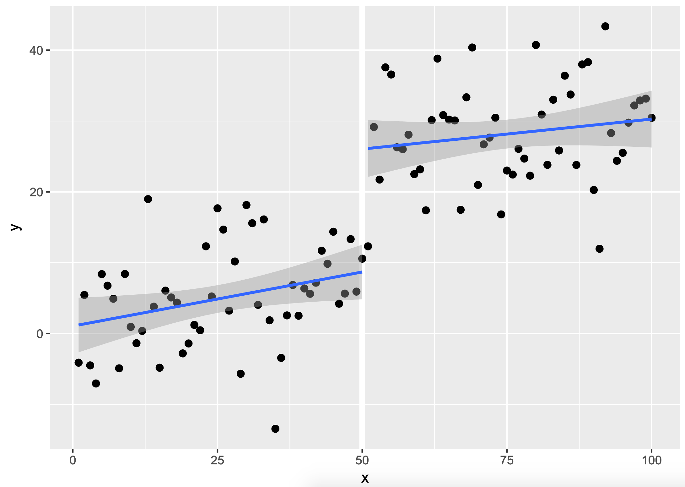
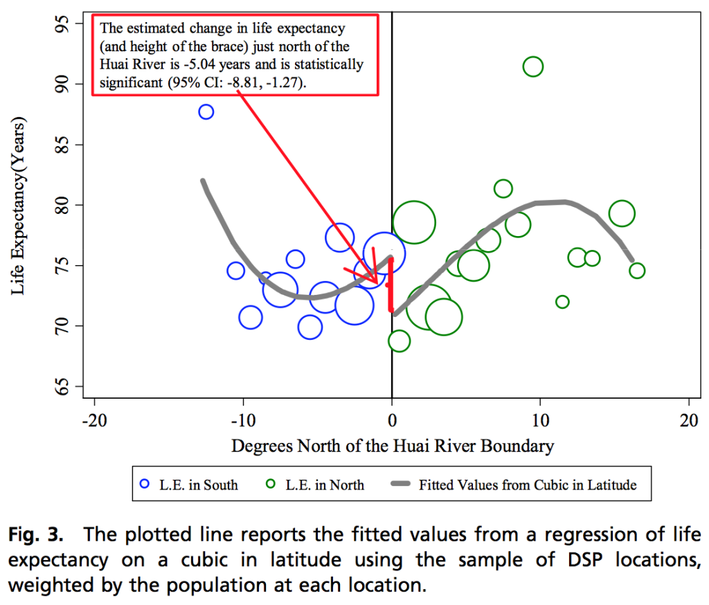

# Regression Project

## Description

[Regression discontinuity design](https://en.wikipedia.org/wiki/Regression_discontinuity_design) (RDD) is a method used to identify the effect of a change implemented at a cutoff point. This usually leads to pretty diagrams like this one:

The regression equation for this is

$$y = const + b1 * x + b2 * c$$

Where `const` is the Y intercept, `x` is the independent (feature) variable, and `c` is a dummy variable which indicates if `x > cutoff`. Then, the parameter on `b2` can be t-tested to see if the cutoff had an effect on `y`.

It can also be used with a polynomial regression on both sides:

Here both sides have a different polynomial degree 2 regression, so the equation uses interaction variables:

$$y = const + b1 * x + b2 * x^2 + b3 * c + b4 * x * c + b5 * x^2 * c$$

Note that you can always overfit the regressions on each to make sure that the gap seems meaningful when it's not. [Gelman & Imbens (2018)](./resources/2018_gelman_jbes.pdf) argue that you should never use more than degree 2 polynomials in RDD. Even degree 2 is sometimes an overfit.

This method has even been used to estimate the effect of lockdown measures, lie in [this CDC study](https://www.cdc.gov/mmwr/volumes/69/wr/mm6947e2.htm?s_cid=mm6947e2_w). For reference on RDD design, [Lee & Lemieux's book chapter](./resources/RDDEconomics.pdf) on RDD is a good technical reference.

## References / Resources

- [Why High-Order Polynomials Should Not BeUsed in Regression Discontinuity Designs](./resources/2018_gelman_jbes.pdf)
- [Trends in County-Level COVID-19 Incidence in Counties With and Without a Mask Mandate — Kansas, June 1–August 23, 2020](https://www.cdc.gov/mmwr/volumes/69/wr/mm6947e2.htm?s_cid=mm6947e2_w)
- [Regression Discontinuity Designs in Economics](./resources/RDDEconomics.pdf)

## Your task

Your task is to use RDD to estimate the effect of the following events in Quebec:

1. The 20/3/2020 lockdown
2. The reopening of schools on 31/8/2020
3. The 25/12/2020 lockdown

### Requirements

You need to find data on at least one COVID measure for `y` (either COVID cases, hospitalizations or deaths) and provide the following for each:

- A RDD plot similar to the ones shown above
- An interpretation of the p-value on the effect of the measure taken (the cutoff parameter)
- A justification on the design of your regression:

  - The amount of time included on both sides of the cutoff (longer is not necessarily better)
  - The polynomial degree (higher is not always better)
  - Other regression design considerations

- A 2 paragraph explanation of your findings for that event.
